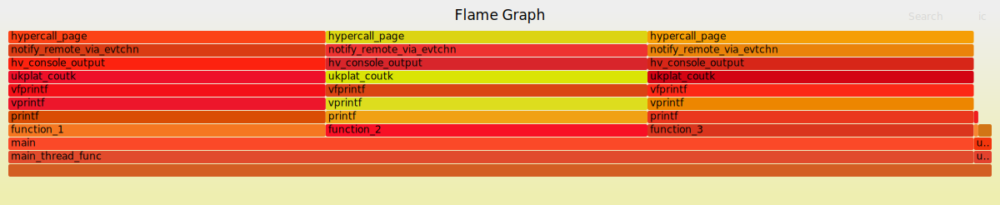
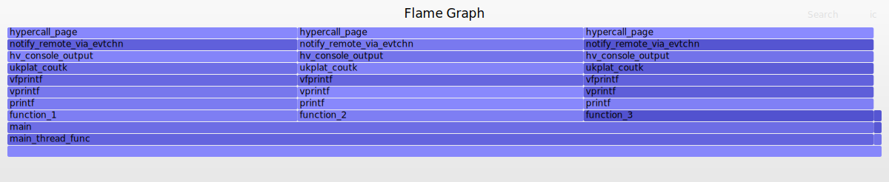
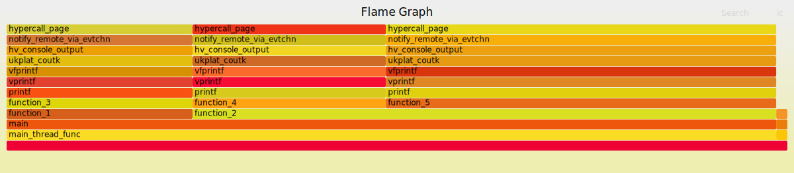

# Uniprof-FlameGraph

This demo was made for my diploma project for the Faculty of Automation and Computers, Polytechnic University of Bucharest.

## Unikernel
[Unikernel](http://unikernel.org/) is a virtualization method that encompasses all the positive aspects of other virtualization solutions, low memory consumption and speed of containers, but also the level of security that virtual machines offer through isolation.

## Unikraft
[Unikraft](https://unikraft.org/) is a unikernel that creates an image of the application together with all its dependencies, in an executable, through an easy and fast process for the user, having a configuration mechanism. Measuring the performance of applications is becoming an increasingly important step, and Unikraft does not have a tool to measure any bottleneck that may occur inside the application. 

## Uniprof & Flame Graph
The objective of my thesis was to integrate a performance measurement utility for unikernels, [Uniprof](http://sysml.neclab.eu/projects/uniprof/), with Unikraft and to display the data in a pretty format using [Flame Graph](http://www.brendangregg.com/flamegraphs.html). At this moment, you can measure the performance and you can see the possible bottlenecks for an application running on a Xen platform.

## Evaluation

To generate stack traces and the flame graph, I use the script that I created which does the following:

1.  Start Unikraft application
2.  Start Uniprof to get stack traces
3.  Run nm to find symbol table
4.  Use symbolize to map addresses
5.  Run stack collapse to format stack trace for Flame Graph
6.  Generate Flame Graph representation


### Test Application 1

For this test you can see the source code in [apps/app-test-1](https://github.com/gabrielmocanu/Uniprof-FlameGraph/tree/main/apps/app-test-1).

As you can see, we called each function 50.000, and in the flame graph they appear on the same level with rectangles of equal size.


Also, here I changed the color palette, but I got the same output.




### Test Application 2

Here we have two main functions (function_1 and function_2). From the first function we call function_3 50.000 times and from the second function we call function_4 50.000 times and function_5 100.000 times.

You can see that the rectangle for function_5 is 2 times larger than function_3 and function_4, and the rectangle for function_2 is 3 times larger than function_1, because it was in stack traces only for function_3, called by 50.000 compared to 200.000 calls in total.

For this test you can see the source code in [apps/app-test-2](https://github.com/gabrielmocanu/Uniprof-FlameGraph/tree/main/apps/app-test-2).




To make these graphics I built the [generateFlameGraph.sh](https://github.com/gabrielmocanu/uniprof/blob/master/generateFlameGraph.sh) script and you can use it with the following arguments for test application 1:

```
bash generateFlameGraph.sh -f 5 -t 120 \
-n app-test-1 \
-c /root/gmocanu/Uniprof-FlameGraph/apps/app-test-1/app-test-1.cfg \
-x /root/gmocanu/Uniprof-FlameGraph/apps/app-test-1/build/app-test-1_xen-x86_64.dbg
```

Also you can try help argument for more information:
```
bash generateFlameGraph.sh --help
Usage: generateFlameGraph.sh -f freq -t time -n domain -c path_to_conf -x path_to_exec

 -f | --frequency        : Frequency(Optional)
 -t | --time             : Time(Optional)
 -n | --domain           : Domain name(Mandatory)
 -c | --conf             : Path to configuration file(Mandatory)
 -x | --exec             : Path to executable(Mandatory)
 -h | --help             : Help argument

```


For more information about this project you can check out my documentation for my [Diploma Project](https://github.com/gabrielmocanu/uniprof/blob/master/Diploma_Project_Mocanu_Gabriel.pdf).